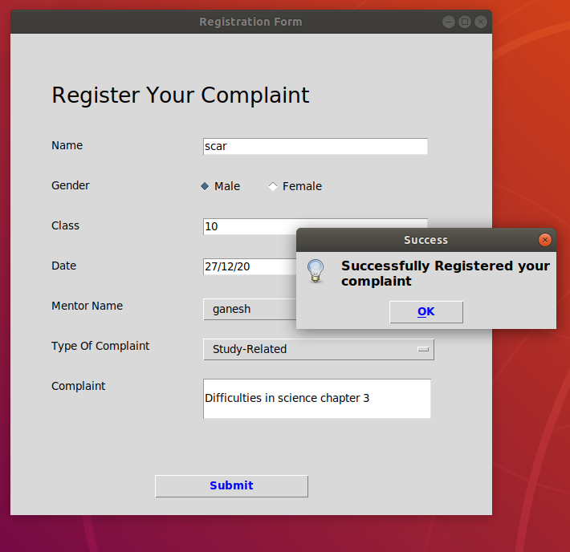
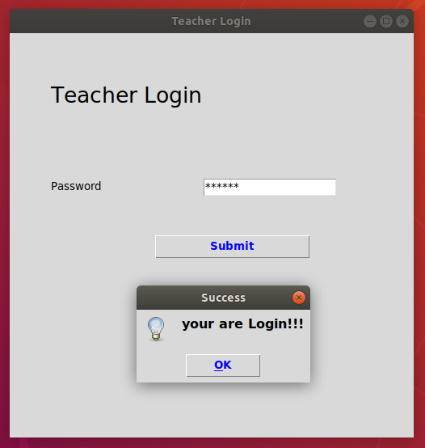
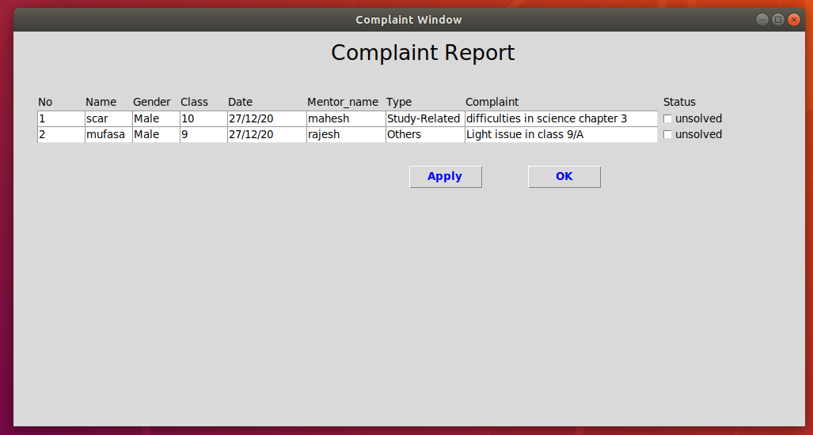
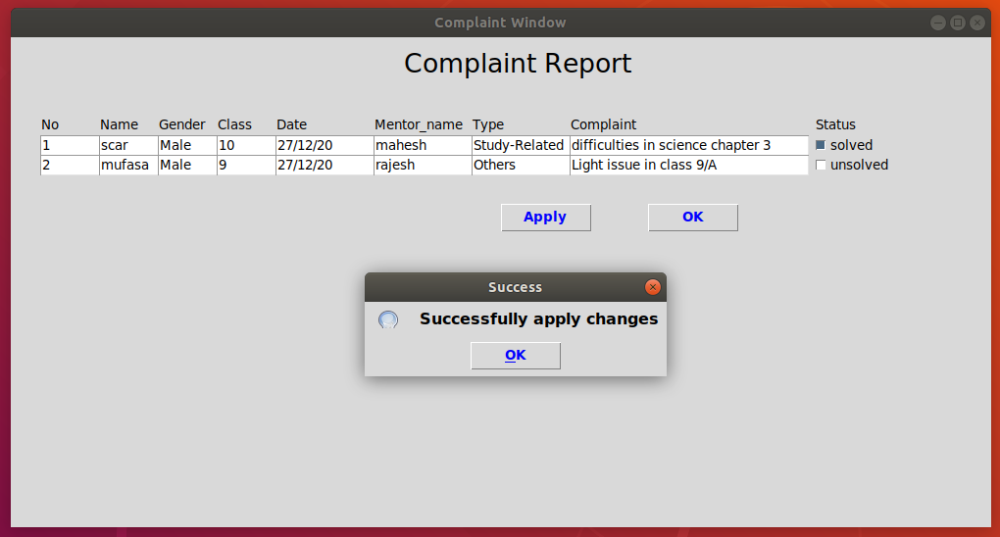
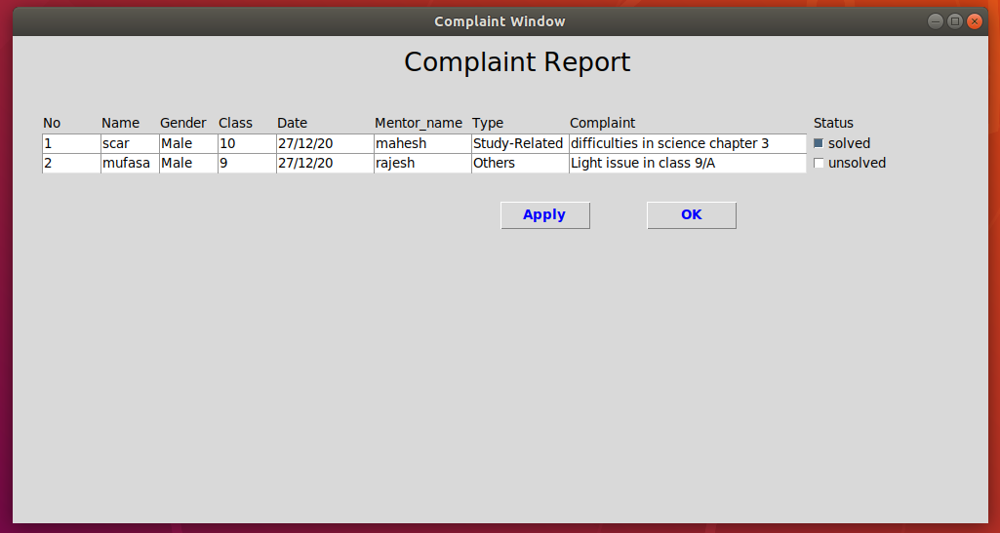

# Tkinter Application

<h2>Overview:</h2>
Simple Complaint management system for school.Where each student can register their complaint. 
and any teacher able to monitor complaint and After solving mark them solved/unsolved respectively.  

<h2>Database:</h2>

**Database used:** MYSQL 
**Db_name:** complaint_management 
**Table_name:** register_complaint  

<h2>Installation:</h2>
1.Create new virtual python environment python3 -m venv venv 
2.Activate virtual python environment source venv/bin/activate 
3.Follow installation_guide.txt in repo  

<h2>Usage:</h2>
1.Clone github repository in your local system 
2.Run Python file: $ python main.py  

<h2>Screenshots: </h2>

 </img> 
 Fig:1 Selection Window: 

 </img> 
 Fig:2 Complaint Registration Window: 

 </img> 
 Fig:3 Teacher Login Window: 

 </img> 
 Fig:4 Complaint Display Window: 

 </img> 
 Fig:5 Updating Status of complaint: 

 </img> 
 Fig:6 Updated Complaint Display Window : 

